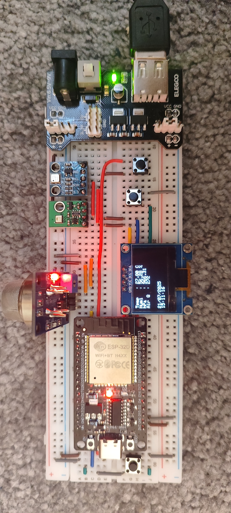

## Sensors Used

- **MQ-135** – Air quality (gases)
- **AHT20** – Temperature & humidity
- **BMP180** – Temperature & pressure

## Data Export

The station publishes collected sensor data to a specified **MQTT broker** for integration with external systems (e.g., Home Assistant, Grafana, Node-RED).

## Device Preview

